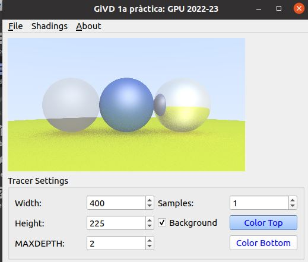
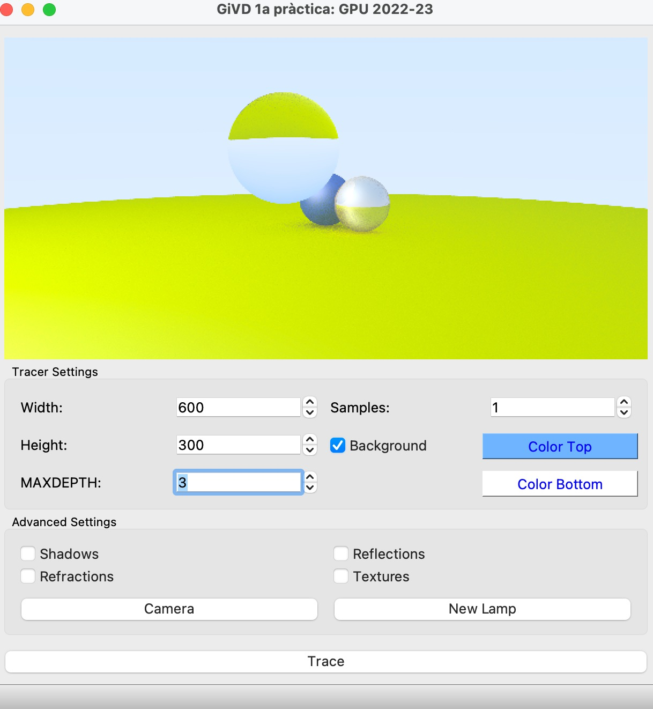
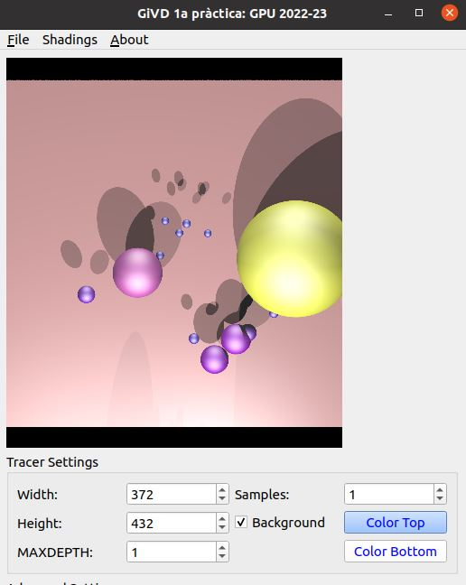

# RayTracingToy
Práctica  1 - GiVD 2022-23

En este archivo es necesario realizar el informe de la práctica 1.

## Equipo:
**Letra y número del equipo:** a01 
* Alba Lopez Herrera.
* Pablo Maria Arranz Pou. 
* Marc Lirola Tortosa.
* Daniela Ocampo Figueroa.

### Features (marque las que ha hecho y quién las ha hecho)
- Fase 0
    - [x] Background con degradado
      - Daniela Ocampo
    - [x] Color Shading
     - Daniela Ocampo, Pablo Maria Arranz
    - [x] Normal Shading
     - Daniela Ocampo 
    - [x] Depth Shading
      - Alba lopez
    - [x] Intersección con la escena
      - Daniela Ocampo, Alba Lopez, Pablo Maria Arranz, Marc Lirola Tortosa. 
 - Fase 1
    - Creación de nuevos objetos e interseccion (VIRTUALWORLD) 
        - [x] Hit Box
          - Daniela Ocampo, Alba Lopez
        - [x] Hit Triangle
          - Pablo Maria Arranz, Marc Lirola Tortosa
        - [x] Hit Malla
          - Pablo Maria Arranz, Marc Lirola Tortosa
    - Creación de REAL DATA
        - [x] FITTED PLANE: Plano de tierra
          - Alba Lopez, Daniela Ocampo
        - [x] Transformaciones Traslación y Escalado con gizmos esferas
          - Alba Lopez, Daniela Ocampo
        - [x] Gizmo de Box
          - Alba Lopez, Daniela Ocampo
        - [x] Nuevos datos
          - Alba Lopez, Daniela Ocampo
 - Fase 2
     - [x] Blinn-Phong
        - Pablo Maria Arranz, Marc Lirola Tortosa
     - [x] Sombras
       - Pablo Maria Arranz, Marc Lirola Tortosa
     - [x] Cell shading
        - Pablo Maria Arranz, Marc Lirola Tortosa
     - [x] Refleciones
       - Daniela Ocampo
     - [x] Transparencias
       - Alba Lopez
     - [x] Visualización con datos reales
        - Alba Lopez, Daniela Ocampo
  - Fase 3
     - [x] Material textura
       - Pablo Maria Arranz, Marc Lirola Tortosa, Alba Lopez
        
       

- Partes opcionales: 
  - [ ] Cilindros
   
  - [ ] Escena CSG
  
  - [ ] Más de una propiedad en los datos reales
   
  - [ ] Mapeo de los datos reales en una esfera
  
    
    
### Explicación de la práctica    
  * **Organización de la práctica**
    * Al principio, tuvimos dificultades para planear una estrategia, ya que enfrentamos problemas para instalar el programa y ejecutar la práctica. No logramos que         funcionara en Windows y esto causó un retraso significativo, lo que se reflejó en la última semana, donde tuvimos mucho trabajo acumulado.

    * Una vez que solucionamos los problemas, decidimos dividirnos en dos subgrupos de trabajo debido a la dificultad para coordinar los horarios de los cuatro               integrantes. Sin embargo, acordamos tener reuniones los viernes a las 9:00 am para compartir nuestro progreso, intercambiar ideas y abordar cualquier problema         que surgiera. Además, tratábamos de llegar a las clases del lunes con preguntas específicas para avanzar más efectivamente.
  
  * **Decisiones a destacar**
    * Acordamos distribuir las tareas de manera independiente entre los subgrupos para evitar dependencias y posibles retrasos.

    * La división del trabajo en ramas distintas resultó ser una excelente decisión, ya que permitió un mayor avance en el proyecto, facilitó la detección de errores y       facilitó la comprensión de los cambios realizados por los otros integrantes.

### Screenshots de cada fase
* **Fase 0**: 

    * Hemos modificado el método **RayPixel** para obtener él degrado, obtenemos primero por medio del setup el color que se le fue asignado al fondo, tanto para la parte superior(colorTop) como a la inferior(colorBotton) y calculamos el factor de degrado.

    </img>

  

* Implementación de los diferentes tipos de shading (Color Shading, Normal Shading,  Depth Shading) y comprobamos la intercepccion más cercana con la escena recorriendo todos los objectos en el método hit de la clase Scene:
  

    
    </img>
    
    </img>
    
    </img>
    
    

  
* **Fase 1**:

    * **Implementacion de Box**: 

    
    </img>
    
    </img>
    
    

  
 <b>Implementación de triangulo:<b> 

    </img>

  
<b>Implementación de MESH<b>

    </img>

    
<b>Creación de REAL DATA: <b>  

Inicialmente, probamos con el data0.json para cargar la esfera en el fittedPlane, hemos tenido que hacer el debug para encontrar que el material que tenia el fittedPlane era materialTexture y nos daba error porque aún no lo teníamos creado, por lo tanto, al momento de hacer las experimentaciones, hemos cambiado este material por Lambertian, también hemos creamos un objeto gizmo de tipo Box, el cual se puede encontrar con el nombre de box_data.json, y visualizamos data10.json , ajustando el setup  Setup_fase1_data10.json

   

    
    </img>
    

  

    
    </img>
    

  

    
    </img>
    

  

### Fase 2

-   ¿Dónde añadirías un atributo numSamples que defina el número de rayos por píxel y así controlar este hecho?
El atributo numSamples lo hemos añadido a setup. Luego lo utilizamos en el run() de Raytracer.

En el paso 1.3 dice: Los colores se ven algo apagados. Para despejar la imagen, se utiliza una corrección del color final
calculado. Este hecho se llama Gama Correction. Se trata de realizar la raíz cuadrada de cada canal del color justo antes de pintarlo. ¿Dónde harás esta corrección?
Lo hemos hecho dentro del for del numSamples en el run() de Raytracer.

    </img>

En el paso 2.2 se pide tomar capturas de blinn-phong paso a paso. Aquí los resultados:
Si sólo se calcula la componente ambiente, se obtiene una imagen similar a:

    </img>

Solo con la componente difusa:

    </img>

Solo con la especular: 

    </img>

Con las tres juntas:

    </img>

Y añadiendo atenuación con profunditad:

    </img>

Y añadiendo ambiente global

    </img>

Todas las capturas han sido tomadas cargando la escena virtual twoSpheres.json y el setUp setUpRenderOneSphere.

PASO 2.3 PHONG SHADING

En phong shading hemos cambiado la forma en la que se calcula la parte specular. La calculamos como specular = ks * Is * pow(dot(N, R), shininess). La diferencia con Blinn-Phong es que se calcula el cosinus de N y H, mientras que en PHong se calcula el de N y R.

    </img>

PASO 2.4 CEL SHADING 

    </img>

PASO 3 SOMBRAS

En caso de que haya un objeto entre la luz y el punto donde se está calculando la iluminación, cuál
componente de la fórmula de Blinn-Phong deberá tenerse en cuenta?
Tenemos que multiplicar el factor de sombra por la suma de la componente specluar y difusa por una parte y la atenuacion.
Lo hemos implementadod de la siguiente manera.
color += (specular + diffuse)*(attenuation);
color *= computeShadow(light, p, scene);

BLINN-PHONG SHADOW

    </img>

COLOR SHADOW

    </img>

NORMAL SHADOW

    </img>

PHONG SHADOW

    </img>

CELL SHADOW

    </img>

SHADOW AMB 3 SPHERES

    </img>

EJEMPLO CON 10 FIGURAS

    </img>

* **Implementación de reflexiones**:Creamos un QSpinBox, en main.ui con un slot que fuera actualizando esta variable, con el fin de controlar la recursividad de rayos reflectivos en el método rayPixel, en las siguientes imágenes, se pueden visualizar los resultados obtenidos cambiando el valor del MAXDEPTH, en 1 y en 10.

En las siguientes imagenes se ha utilizado el Setup_fase2_punto4_2.json que configura la escena con las especificaciones pedidas en el punto 4.2 y se carga la virtualScene twoSpheres.json.

    
    </img>
    
    </img>
      

  

-   El objetivo es que entre mas rayos se generen, capturemos mas detalles de nuestra imagen.
-   Hemos creado un material metálico, utilizamos la escena virtual,  Fase2_three_sphere.json. configuramos los parámetros de renderizado en el archivo setupRenderThreeSphere.json. Al comparar la primera y la segunda imagen obtenidas, se puede observar una mejora en la calidad de los reflejos del material metálico en la segunda imagen, la cual tiene un MAXDEPTH de 10.

    
    </img>
    
     </img>
     

  
-   Hemos utilizado un factor fuzzy de 0.02 en el scatter del material metálico para lograr una imagen más realista.

    
    </img>
      

  

* **Implementación de transparencias: ** 
-   Se implemento el material Transparente y se ha probado utilizando la escena virtual spheresMetalTransp.json y el setup: setupRenderTwoSpheres.json, la siguientes imagenes muestras como cambia la imagen al incrementar MAXDEPTH.

    
    </img>
    
     </img>
    
    </img>
      

  

-   Se implemento el material Transparente y se ha probado tambien utilizando la escena virtual fourSpheres.json y el setup: setupRenderFourSpheres.json, la siguientes imagenes muestras como cambia la imagen al incrementar MAXDEPTH.

    
    </img>
    
     </img>
    
    </img>
      

  

* **Visualización con datos reales: **
- Hicimos pruebas con los realDatas y setup, tuvimos algunos inconvenientes para visualizar dadesBCNTransparent.json con los setups setupDataBCNTransparent.json y setupRenderData0.json, intentamos hacer el debug para encontrar el error pero no logramos arreglarlo.

- Hemos modificado el método objectMaps de la clase SceneFactoryData para tuviera en cuenta un valor mínimo cerrado en 0.1 a la hora de calcular la escala y multiplicando por 0.5 el rango máximo en x, y y z del mundo virtual.

*   La siguiente imagen se visualiza con  dadesBCNOneValue.json y setupDataBCNOneValue.json

    
    </img>
    

  
* La siguiente imagen se visualiza con dadesBCN_Zoom.json y setupDataBCN_Zoom.json

    
     </img>
    

  
* La siguiente imagen se visualiza con dadesBCN.json y setupDataBCN.json

    
    </img>
      

  

    
    </img>
    

### Fase 3

* Para esta última fase se ha implementado el material textura, todo y que no se ha conseguido ver la fotografía del mapa de Europa en la base. 

    
    </img>
    

* **Opcionales**:

* **Más visualizaciones**:

   * Para todas las imágenes, incluya aqui la imagen obtenida y los archivos de datos y de configuración que ha utilizado
